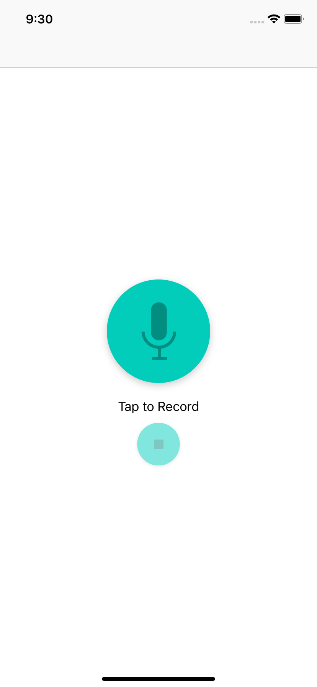
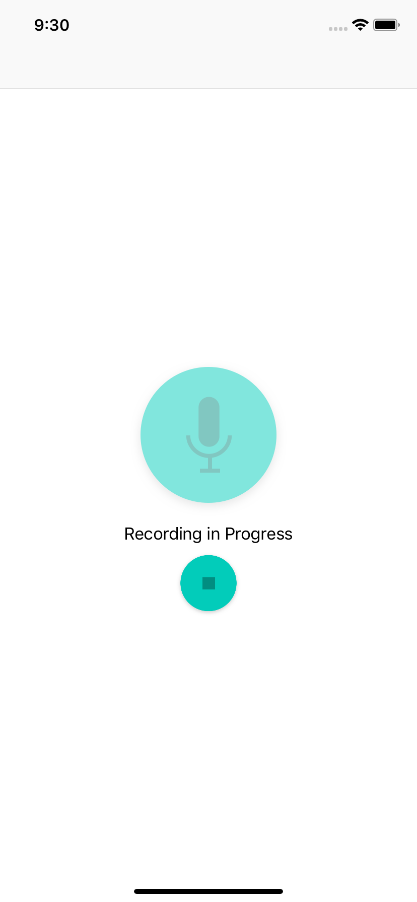
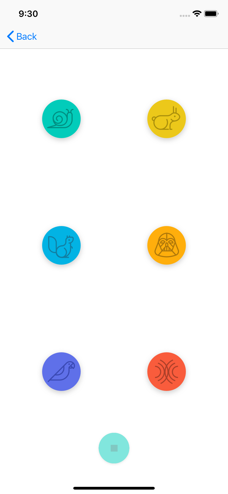

# Pitch Perfect

An iOS app that uses your phone's microphone to record audio and then apply audio effects on the recording: slow speed, high speed, low pitch, high pitch, echo and reverb.

## Technologies Used:

UIKit

AVFoundation

## Build

This app was build in Swift 4.1 and Xcode 10.0

## Screenshots

  

